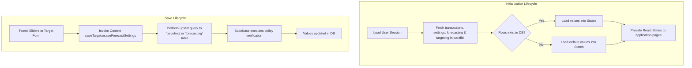

# Database Schema & Independent Persistence Documentation

This document explains the schema structure of the Supabase backend database and describes exactly how user-specific **Forecast** and **Target** configurations are stored in separate, independent, top-level tables.

---

## 1. Exposed Database Tables

The application interacts with five primary tables in the public schema of the Supabase PostgreSQL database. Row-Level Security (RLS) policies are active on all tables to ensure queries are strictly scoped to the authenticated user's ID (`auth.uid()`).

### `user_settings`
Manages profile information, localized currency preferences, and global settings for the business owner.
- `user_id` (uuid, Primary Key): Links directly to the `auth.users` identifier.
- `business_name` (text, Required): Name of the retail shop or business workspace.
- `currency_code` (text, Required): Three-letter currency identifier (e.g., `INR`, `USD`).
- `currency_symbol` (text, Required): Symbol symbol (e.g., `₹`, `$`).
- `owner_name` (text, Optional): Full name of the business owner.
- `starting_balance` (numeric, Required): Baseline reserve starting balance (defaults to `0`).

### `forecasting`
Stores user-specific cash flow forecasting options.
- `user_id` (uuid, Primary Key, references `auth.users`): Restricts records to the authenticated owner.
- `growth_rate` (integer, Required): Compounding revenue growth percentage (defaults to `10`).
- `savings_rate` (integer, Required): Budget reduction percentage for expenses (defaults to `15`).
- `horizon` (integer, Required): Forecast timeline in months (defaults to `6`).
- `updated_at` (timestamp, Required): Time of the last forecast settings save.

### `targeting`
Stores user-specific financial targets and milestones.
- `user_id` (uuid, Primary Key, references `auth.users`): Restricts records to the authenticated owner.
- `revenue_target` (numeric, Required): Monthly revenue target (defaults to `0`).
- `net_profit_target` (numeric, Required): Monthly net profit milestone (defaults to `0`).
- `expense_ceiling` (numeric, Required): Monthly maximum budget cap for expenses (defaults to `0`).
- `updated_at` (timestamp, Required): Time of the last targets save.

### `daily_entries`
Stores daily aggregated ledger transaction records.
- `id` (uuid, Primary Key): Unique row identifier.
- `user_id` (uuid, Foreign Key): Scopes the transaction record to the owner.
- `date` (date, Unique per user): The calendar date of the sheet (format `YYYY-MM-DD`).
- `title` (text): Summary of the day's events.
- `category` (text): Primary category classifier.
- `online_amount` (numeric): Total daily revenue processed via online channels (e.g., card, UPI).
- `cash_amount` (numeric): Total daily revenue processed via cash.
- `expenses_amount` (numeric): Sum of all expense items logged for this date.
- `notes` (text): Optional descriptions or remarks.

### `expense_items`
Lists individual itemized expense costs linked to a daily ledger entry.
- `id` (uuid, Primary Key): Unique row identifier.
- `user_id` (uuid): Scopes the cost item to the owner.
- `entry_id` (uuid, Foreign Key): Links back to the corresponding `daily_entries.id`.
- `title` (text): Description of the cost.
- `amount` (numeric): Total amount spent.

---

## 2. Row-Level Security (RLS)

To ensure privacy and data isolation, both `public.forecasting` and `public.targeting` tables implement standard row-level security:

### `public.forecasting`
```sql
ALTER TABLE public.forecasting ENABLE ROW LEVEL SECURITY;

CREATE POLICY "Users can view their own forecasting" 
  ON public.forecasting FOR SELECT USING (auth.uid() = user_id);

CREATE POLICY "Users can insert their own forecasting" 
  ON public.forecasting FOR INSERT WITH CHECK (auth.uid() = user_id);

CREATE POLICY "Users can update their own forecasting" 
  ON public.forecasting FOR UPDATE USING (auth.uid() = user_id);
```

### `public.targeting`
```sql
ALTER TABLE public.targeting ENABLE ROW LEVEL SECURITY;

CREATE POLICY "Users can view their own targeting" 
  ON public.targeting FOR SELECT USING (auth.uid() = user_id);

CREATE POLICY "Users can insert their own targeting" 
  ON public.targeting FOR INSERT WITH CHECK (auth.uid() = user_id);

CREATE POLICY "Users can update their own targeting" 
  ON public.targeting FOR UPDATE USING (auth.uid() = user_id);
```

---

## 3. Application Lifecycle

The target settings lifecycle is fully handled in the React Context: `src/context/AccountingContext.tsx`.


